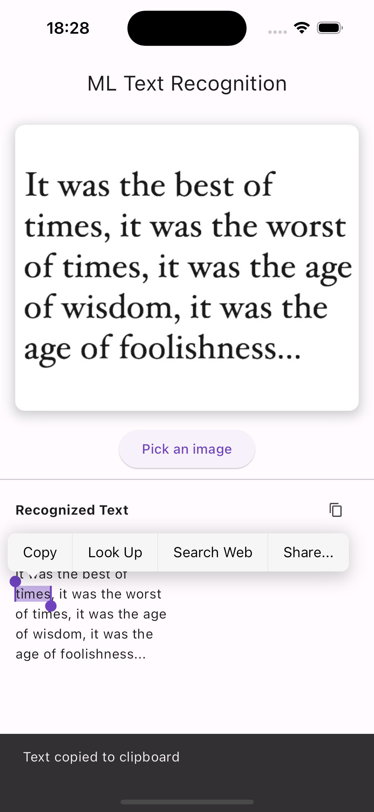

# ML Text Recognition with Flutter

This is the complete project described in the article "ML Text Recognition with Flutter" available to read [here](https://medium.com/@dariovarrialeapps/ml-text-recognition-with-flutter-90894e4829cf).

This is a simple example of how to use the `google_mlkit_text_recognition` plugin to recognize text in an image.

## Getting Started

For help getting started with Flutter, view the online [documentation](https://flutter.io/).

### Install packages

```bash
flutter pub get
```

### Run the app

```bash
flutter run
```

## Screenshots


